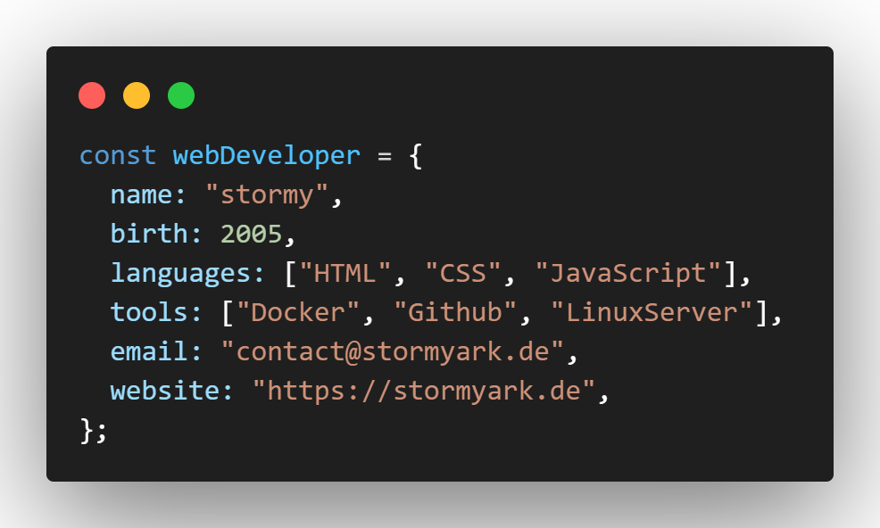

<h3 align="center">
    
</h3>

    

---

<h3 
    align="center"
    style="font-weight: bold">
    Languages
</h3>

    

<h3
    align="center"
    style="font-weight: bold">
    Tools
</h3>

    

<h3
    align="center"
    style="font-weight: bold">
    Design
</h3>

    

---

    

